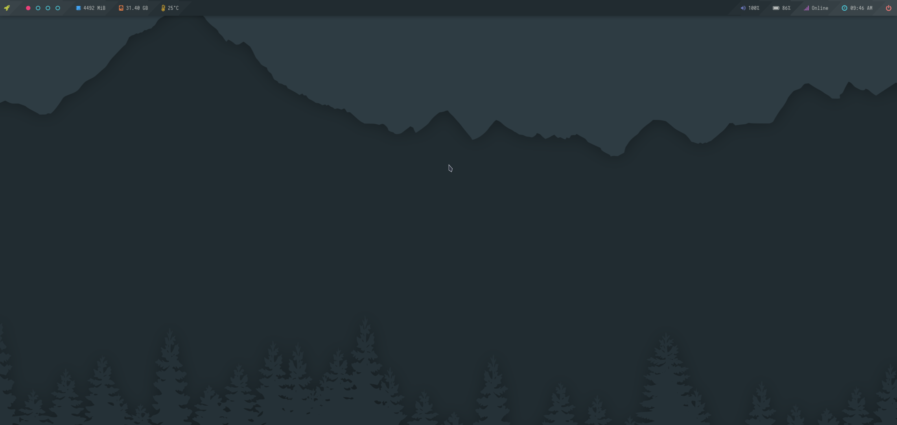
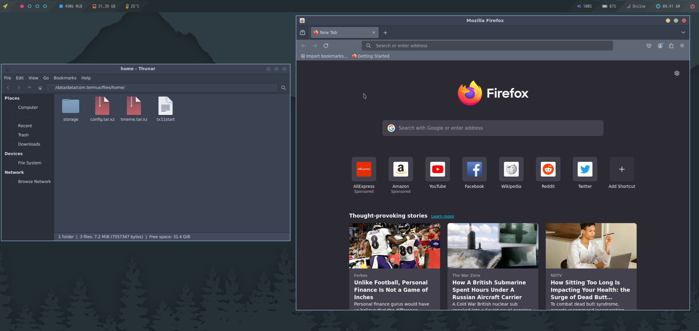
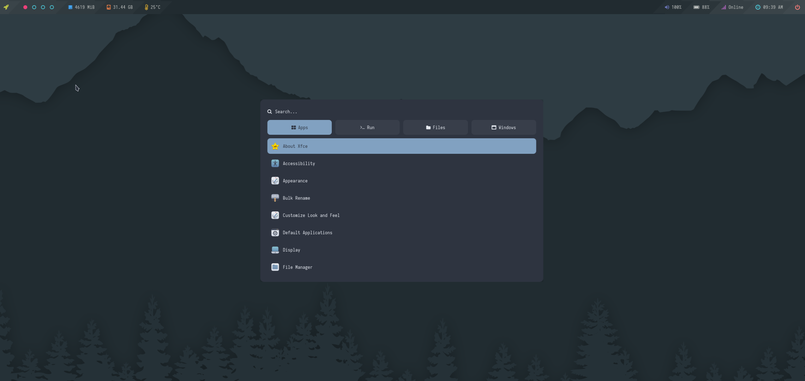
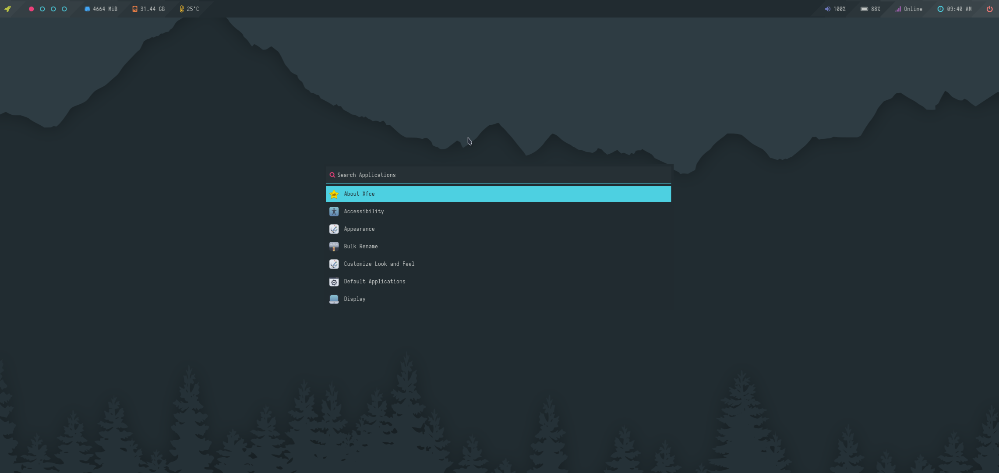
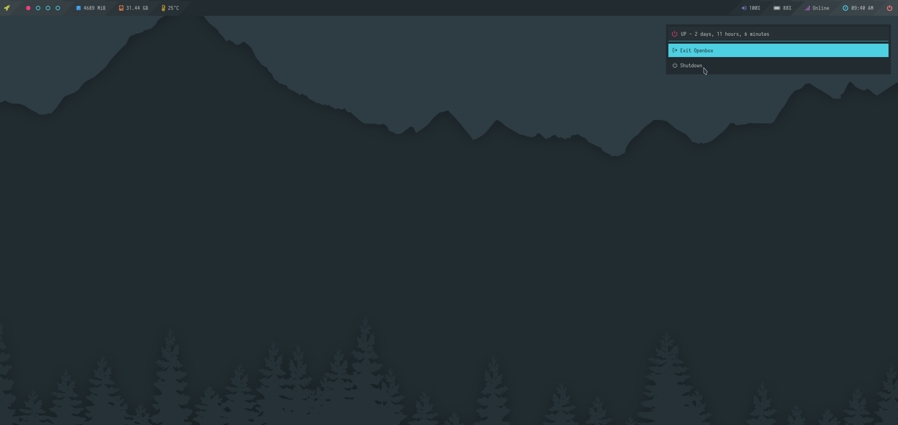

# Termux-dk

> [!WARNING]
> It works but is in the process of change 

# Desktop Styles 

## 1. Nordic Openbox:
### Keybord shortcuts:- [Here](https://github.com/sabamdarif/termux-desktop/blob/main/see-more.md#openbox-keybindings-cheat-sheet)
>Inspired from [adi1090x's termux-desktop](https://github.com/adi1090x/termux-desktop)


<details>
<summary><b style ="font-size: small">Style Details: </summary>
Theme Used: 
<br>

- GTK Theme:- [Nordic-darker](https://www.gnome-look.org/p/1267246)
- Openbox Theme:- [Nord-Openbox](https://gitlab.com/the-zero885/nord-openbox-theme)
- Kvantum:- [Nord-Kvantum](https://store.kde.org/p/1533594)

Icon Used:
<br>

- Icons:- [Nordzy](https://store.kde.org/p/1686927)
- Cursor Theme:- [Nordic-cursors](https://www.gnome-look.org/p/1662218/)

</b>
</details>
<br>

<center></center>

<details style ="font-size: larger">
<summary><b style ="font-size: larger">Screenshots: </b></summary>

| Apps | Dashboard |
|:--:|:--:|
|  |  |
| **Launcher** | **Powermenu**  |
|  |  

</details>

<br>

# Install 

```
git clone https://github.com/VictorH028/termux-dk && cd termux-dk

./setup2.sh 
```

# Start 

```
termux-x11 $DISPLAY -xstartup "dbus-launch --exit-with-session openbox-session"
```

> [!NOTE]
> All the configuration that you find here is a light version for termux without using proot of this project
    > [SEE](https://github.com/sabamdarif/termux-desktop/tree/main) 
